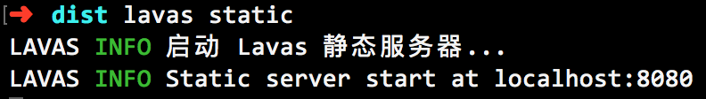

# 10. 构建代码和上线

对于一个应用来说，经过前面的步骤之后基本功能已经开发完整。让我们把注意力移动到代码的构建和上线上面来。

在项目目录输入命令

```bash
lavas build
```

可以对 Lavas 项目进行构建，构建过程如下：


完成后，在项目根目录下会生成一个 `/dist` 目录，这边是构建后的项目代码。我们还可以通过命令

**注意：由于 lavas 导出的模板默认采用的是 ssr 模式，因此 dist 目录下生成的是 Node.js 运行的代码，可以修改 lavas.config.js 中的 ssr 为 false 改为 SPA 模式**

```bash
npm install
```

来安装所有依赖，并使用 Lavas 内置命令

```bash
lavas start
```
运行 ssr: true 模式下产生的代码

来以线上模式运行项目。线上模式的所有代码均为压缩后的，并且 Service Worker 也会生效 (使用 localhost 访问即可)。


```bash 
lavas static
```

如果在 `lavas.config.js` 中 `ssr` 为 false，那么编译之后在 dist 目录下生成的是包含 index.html 的静态文件，这个时候不能通过 lavas start 命令启动，可以通过 `lavas static` 命令来启动


